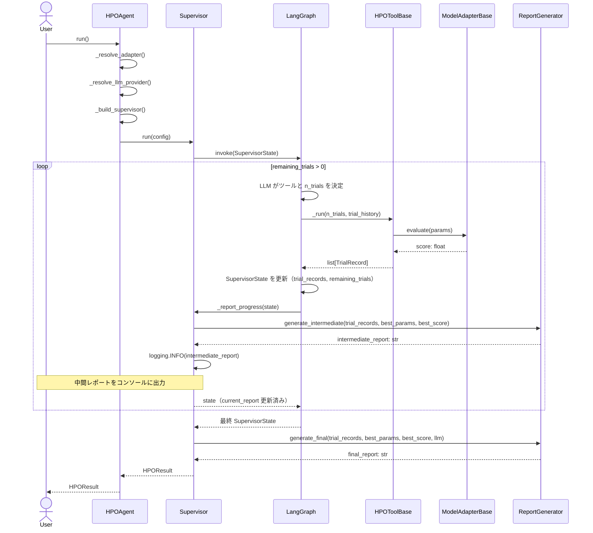
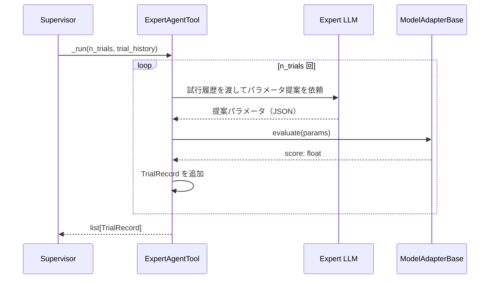

# 実装設計書

## 1. 設計の概要

**プロジェクト名**：hpo-agent
**参照ファイル**：`/doc/requirements.md`

**設計の方針**

- AIエージェント（Supervisor）が複数の最適化ツールを動的に選択・実行するアーキテクチャとし、ツールの追加・差し替えを容易にするためStrategy パターンを採用する。
- モデル・LLM プロバイダーはそれぞれ抽象クラスに依存させることで、MVP（LightGBM / Google Gemini）から他実装への切り替えを修正なしに実現する（OCP・DIP）。
- 状態・設定・結果などデータ保持が責務のクラスは `@dataclass` / `@dataclass(frozen=True)` で表現し、振る舞いを持つクラスと明確に区別する。LLM との入出力スキーマには Pydantic を用いる。

---

## 2. クラス設計

### 2-1. クラス一覧

| クラス名 | 種別 | 責務（単一責任の原則） | 対応する要件の概念 |
|---------|------|---------------------|-----------------|
| `HPOConfig` | データクラス（frozen） | エージェント実行に必要な設定値（乱数シード含む）を保持する | 3.2 入力パラメータ |
| `ParamSpec` | データクラス（frozen） | 1つのハイパーパラメータの型・範囲・スケールを保持する | モデルアダプターのパラメータ空間定義 |
| `ParamSpace` | データクラス（frozen） | パラメータ仕様の集合を保持する | モデルアダプターのパラメータ空間定義 |
| `TrialRecord` | データクラス | 1回の試行結果を保持する | 6.1 試行履歴テーブル |
| `SearchSpaceChangeRecord` | データクラス | 探索空間変更イベント（変更前後の空間・変更時点の試行数・日時）を保持する | 6.2 テキストレポート |
| `HPOResult` | データクラス | 最終出力（最良パラメータ・スコア・履歴・レポート）を保持する | 3.3 出力（HPOResult） |
| `SupervisorState` | Pydantic モデル | LangGraph グラフの状態を保持する | 4.2 スーパーバイザーエージェント |
| `LLMProviderBase` | 抽象クラス | LLMインスタンスを提供するインターフェースを定義する | 5.3 拡張性 |
| `GoogleLLMProvider` | 具象クラス | Google Gemini の LLM インスタンスを提供する | 5.1 初期対応 LLM |
| `OpenAILLMProvider` | 具象クラス | OpenAI GPT の LLM インスタンスを提供する | 5.3 拡張性 |
| `AnthropicLLMProvider` | 具象クラス | Anthropic Claude の LLM インスタンスを提供する | 5.3 拡張性 |
| `ModelAdapterBase` | 抽象クラス | モデルのパラメータ空間取得・評価実行のインターフェースを定義する | 8.1 拡張性 |
| `ParamSpecSchema` | Pydantic モデル | LLM の structured output 用パラメータ仕様スキーマ | LLM 自動生成 |
| `ParamSpaceSchema` | Pydantic モデル | LLM の structured output 用パラメータ空間スキーマ | LLM 自動生成 |
| `LightGBMAdapter` | 具象クラス | LightGBM に対してパラメータ空間取得・評価を実行する | 2.1 初期対応モデル |
| `SklearnAdapter` | 具象クラス | scikit-learn 互換モデル（BaseEstimator）に対してパラメータ空間取得・評価を実行する | 2.1 対応モデル |
| `PyTorchAdapter` | 具象クラス | PyTorch モデルファクトリ関数に対してパラメータ空間取得・評価を実行する | 2.1 対応モデル |
| `HPOToolBase` | 抽象クラス | HPO ツール（探索アルゴリズム）のインターフェースを定義する | 4.3 ツール一覧 |
| `BayesianOptimizationTool` | 具象クラス | Optuna によるベイズ最適化を実行する | 4.3 BayesianOptimizationTool |
| `SobolSearchTool` | 具象クラス | Sobol 列による準ランダム探索を実行する | 4.3 SobolSearchTool |
| `ExpertAgentTool` | 具象クラス | 専門家 AI エージェントによる決め打ち探索を実行する | 4.3 ExpertAgentTool |
| `ChangeSearchSpaceTool` | 具象クラス | 過去の探索結果をもとに探索空間を変更し（狭め・拡大）、`current_param_space` を更新する | 探索空間の動的変更 |
| `ReportGenerator` | 具象クラス | 試行履歴から Markdown レポートを生成する | 6.2 テキストレポート |
| `Supervisor` | 具象クラス | LangGraph グラフを構築し、ツール選択ループを制御する | 4.2 スーパーバイザーエージェント |
| `HPOAgent` | 具象クラス | ユーザーに公開するエントリーポイントとして run() を提供する | 3.1 基本的な使い方 |

---

### 2-2. 各クラスの定義

#### `HPOConfig`

**種別**：データクラス（frozen=True）
**責務**：エージェント実行に必要な設定値を保持する
**対応する要件の概念**：3.2 入力パラメータ

```python
@dataclass(frozen=True)
class HPOConfig:
    model: Any                           # チューニング対象モデル
    eval_fn: Callable[..., float]        # ユーザー定義評価関数
    n_trials: int                        # 総試行回数
    X: Any                               # 特徴量データ
    y: Any                               # ターゲットデータ
    param_space: ParamSpace | None = None  # 最適化対象パラメーター（None のとき adapter のデフォルト使用）
    seed: int | None = None              # 乱数シード（None のとき非決定的）
    prompts: dict[str, str] = field(default_factory=dict)  # エージェント別追加プロンプト
    llm_model: str | None = None         # LLM モデル名（.env 上書き用）
```

**SOLIDチェック**
- S: 設定値の保持のみが責務。バリデーションや実行ロジックは持たない
- O: フィールドの追加は新フィールドを加えるだけで既存コードを変更しない
- D: 抽象に依存する必要がないデータ保持クラスのため DIP 対象外

---

#### `ParamSpec`

**種別**：データクラス（frozen=True）
**責務**：1つのハイパーパラメータの型・範囲・スケールを保持する
**対応する要件の概念**：モデルアダプターのパラメータ空間定義

```python
@dataclass(frozen=True)
class ParamSpec:
    name: str
    type: Literal["int", "float", "categorical"]
    low: float | None = None          # 数値型の下限
    high: float | None = None         # 数値型の上限
    choices: tuple[Any, ...] | None = None  # カテゴリカル型の選択肢
    log: bool = False                 # 対数スケールフラグ
```

**SOLIDチェック**
- S: 1つのパラメータ仕様の保持のみが責務
- O: 新しいスケール型（例：quantized）はフィールド追加で拡張可能
- D: データ保持クラスのため DIP 対象外

---

#### `ParamSpace`

**種別**：データクラス（frozen=True）
**責務**：パラメータ仕様の集合を保持する
**対応する要件の概念**：モデルアダプターのパラメータ空間定義

```python
@dataclass(frozen=True)
class ParamSpace:
    specs: tuple[ParamSpec, ...]
```

**SOLIDチェック**
- S: パラメータ仕様集合の保持のみが責務
- D: データ保持クラスのため DIP 対象外

---

#### `TrialRecord`

**種別**：データクラス（mutable）
**責務**：1回の試行結果（パラメータ・スコア・ツール名・日時・実行時間・AI 判断理由）を保持する
**対応する要件の概念**：6.1 試行履歴テーブル

```python
@dataclass
class TrialRecord:
    trial_id: int
    params: dict[str, Any]
    score: float
    tool_used: str
    timestamp: datetime
    eval_duration: float = 0.0   # モデルの学習・評価にかかった時間（秒、time.perf_counter で計測）
    algo_duration: float = 0.0   # アルゴリズムが次の実験点を算出するのにかかった時間（秒）
    reasoning: str = ""          # AI の判断理由（Supervisor のツール選択理由 / ExpertAgentTool のパラメーター提案理由）
```

**SOLIDチェック**
- S: 1試行分の記録保持のみが責務（時間計測結果・AI 判断理由も試行の一部として保持する）
- O: カラム追加はフィールド追加のみで対応可能
- D: データ保持クラスのため DIP 対象外

---

#### `SearchSpaceChangeRecord`

**種別**：データクラス（mutable）
**責務**：探索空間変更イベント（変更前後の空間・変更時点の試行数・日時・Supervisor の理由）を保持する
**対応する要件の概念**：6.2 テキストレポート

```python
@dataclass
class SearchSpaceChangeRecord:
    trial_id_at_change: int      # 変更時点で完了していた試行数
    timestamp: datetime          # 変更が行われた日時
    old_param_space: ParamSpace  # 変更前の探索空間
    new_param_space: ParamSpace  # 変更後の探索空間
    reasoning: str = ""          # Supervisor のツール選択理由
```

**SOLIDチェック**
- S: 探索空間変更イベントの記録保持のみが責務
- D: データ保持クラスのため DIP 対象外

---

#### `HPOResult`

**種別**：データクラス（mutable）
**責務**：最終出力（最良パラメータ・スコア・履歴・レポート）を保持する
**対応する要件の概念**：3.3 出力（HPOResult）

```python
@dataclass
class HPOResult:
    best_params: dict[str, Any]
    best_score: float
    trials_df: pd.DataFrame
    report: str
```

**SOLIDチェック**
- S: 出力データの保持のみが責務
- D: データ保持クラスのため DIP 対象外

---

#### `SupervisorState`

**種別**：Pydantic モデル（LangGraph 状態）
**責務**：LangGraph グラフが管理する実行状態を保持する
**対応する要件の概念**：4.2 スーパーバイザーエージェント

```python
class SupervisorState(BaseModel):
    messages: list[BaseMessage]
    trial_records: list[TrialRecord]
    remaining_trials: int
    config: HPOConfig
    current_report: str = ""                                              # 直近の中間レポート（ツール実行ごとに更新）
    last_tool_reasoning: str = ""                                         # 直前のツール選択理由（Supervisor が出力した理由）
    current_param_space: ParamSpace | None = None                         # change_search_space による変更後の空間
    search_space_change_history: list[SearchSpaceChangeRecord] = []       # 探索空間変更イベントの履歴
```

**SOLIDチェック**
- S: LangGraph グラフの状態保持のみが責務
- D: LangGraph の `BaseModel` に依存（LangGraph の抽象に従う）

---

#### `LLMProviderBase`

**種別**：抽象クラス
**責務**：LLM インスタンスの提供インターフェースを定義する
**対応する要件の概念**：5.3 拡張性

```python
class LLMProviderBase(ABC):
    @abstractmethod
    def get_llm(self, temperature: float = 0) -> BaseChatModel: ...
```

**SOLIDチェック**
- S: LLM インスタンス提供のみが責務
- O: 新 LLM プロバイダーはサブクラス追加で対応（既存コード変更不要）
- I: メソッドが1つのみのため分離不要
- D: `Supervisor` は `LLMProviderBase` に依存し、具体実装に依存しない

---

#### `GoogleLLMProvider`

**種別**：具象クラス
**責務**：Google Gemini の LLM インスタンスを提供する
**対応する要件の概念**：5.1 初期対応 LLM

```python
class GoogleLLMProvider(LLMProviderBase):
    def __init__(self, api_key: str, model_name: str) -> None: ...
    def get_llm(self, temperature: float = 0) -> BaseChatModel: ...
```

**SOLIDチェック**
- S: Google Gemini LLM の提供のみが責務
- L: `LLMProviderBase` の契約（`get_llm` が `BaseChatModel` を返す）を守る

---

#### `ModelAdapterBase`

**種別**：抽象クラス
**責務**：モデルのパラメータ空間取得と評価実行のインターフェースを定義する
**対応する要件の概念**：8.1 拡張性

```python
class ModelAdapterBase(ABC):
    @abstractmethod
    def get_default_param_space(self) -> ParamSpace: ...

    @abstractmethod
    def evaluate(self, params: dict[str, Any]) -> float: ...
```

**SOLIDチェック**
- S: モデル評価インターフェースの定義のみが責務
- O: 新モデルはサブクラス追加で対応（既存コード変更不要）
- I: `get_param_space` と `evaluate` は常にセットで使用されるため分離しない
- D: `HPOToolBase` の実装は `ModelAdapterBase` に依存する

---

#### `LightGBMAdapter`

**種別**：具象クラス
**責務**：LightGBM に対してパラメータ空間取得・評価を実行する
**対応する要件の概念**：2.1 初期対応モデル（MVP）

```python
class LightGBMAdapter(ModelAdapterBase):
    def __init__(
        self,
        model: lgb.LGBMModel,
        eval_fn: Callable[..., float],
        X: Any,
        y: Any,
    ) -> None: ...

    def get_default_param_space(self) -> ParamSpace: ...
    def evaluate(self, params: dict[str, Any]) -> float: ...
```

**SOLIDチェック**
- S: LightGBM 固有のパラメータ空間定義・評価のみが責務
- L: `ModelAdapterBase` の契約（戻り値の型）を守る

---

#### `SklearnAdapter`

**種別**：具象クラス
**責務**：scikit-learn 互換モデル（BaseEstimator）に対してパラメータ空間取得・評価を実行する
**対応する要件の概念**：2.1 対応モデル

```python
class SklearnAdapter(ModelAdapterBase):
    def __init__(
        self,
        model: BaseEstimator,
        eval_fn: Callable[..., float],
        X: Any,
        y: Any,
    ) -> None: ...

    def get_default_param_space(self) -> ParamSpace: ...  # NotImplementedError を送出
    def evaluate(self, params: dict[str, Any]) -> float: ...
```

- `get_default_param_space()` は `NotImplementedError` を送出する。sklearn はモデルが多様なためデフォルト空間を持たない。使用時は `HPOAgent` に `param_space` を必ず指定する
- `evaluate()` では `sklearn.base.clone()` を使用してモデルを複製する（fitted 状態をリセットするため `copy.deepcopy` ではなく `clone` を採用）

**SOLIDチェック**
- S: sklearn 互換モデルの評価のみが責務
- L: `ModelAdapterBase` の契約（戻り値の型）を守る

---

#### `HPOToolBase`

**種別**：抽象クラス（LangChain `BaseTool` を継承）
**責務**：HPO ツール（探索アルゴリズム）のインターフェースを定義する
**対応する要件の概念**：4.3 ツール一覧

```python
class HPOToolBase(BaseTool, ABC):
    adapter: ModelAdapterBase

    @abstractmethod
    def _run(self, n_trials: int, trial_history: list[TrialRecord]) -> list[TrialRecord]: ...
```

**SOLIDチェック**
- S: 探索ツールの実行インターフェース定義のみが責務
- O: 新探索アルゴリズムはサブクラス追加で対応（既存コード変更不要）
- D: `ModelAdapterBase` の抽象に依存し、LightGBM 等の具体実装に依存しない

---

#### `BayesianOptimizationTool`

**種別**：具象クラス
**責務**：Optuna によるベイズ最適化を実行し、試行結果リストを返す
**対応する要件の概念**：4.3 BayesianOptimizationTool

```python
class BayesianOptimizationTool(HPOToolBase):
    name: str = "bayesian_optimization"
    description: str = "Optuna を用いたベイズ最適化による探索"

    def _run(self, n_trials: int, trial_history: list[TrialRecord]) -> list[TrialRecord]: ...
```

**SOLIDチェック**
- S: Optuna ベイズ最適化の実行のみが責務
- L: `HPOToolBase` / `BaseTool` の契約を守る

---

#### `SobolSearchTool`

**種別**：具象クラス
**責務**：Sobol 列による準ランダム探索を実行し、試行結果リストを返す
**対応する要件の概念**：4.3 SobolSearchTool

```python
class SobolSearchTool(HPOToolBase):
    name: str = "sobol_search"
    description: str = "Sobol 列による準ランダム探索"

    def _run(self, n_trials: int, trial_history: list[TrialRecord]) -> list[TrialRecord]: ...
```

**SOLIDチェック**
- S: Sobol 探索の実行のみが責務
- L: `HPOToolBase` / `BaseTool` の契約を守る

---

#### `ExpertAgentTool`

**種別**：具象クラス
**責務**：専門家 AI エージェントによる決め打ちパラメータ提案・評価を実行し、試行結果リストを返す
**対応する要件の概念**：4.3 ExpertAgentTool

```python
class ExpertAgentTool(HPOToolBase):
    name: str = "expert_agent"
    description: str = "専門家 AI エージェントによる決め打ち探索"
    llm: BaseChatModel
    system_prompt: str

    def _run(self, n_trials: int, trial_history: list[TrialRecord]) -> list[TrialRecord]: ...
```

**SOLIDチェック**
- S: LLM による決め打ち探索の実行のみが責務
- D: `BaseChatModel` の抽象に依存し、特定 LLM に依存しない

---

#### `ChangeSearchSpaceTool`

**種別**：具象クラス（BaseTool）
**責務**：LLM から受け取った `param_updates` を検証して `ParamSpace` を更新する。試行は実行しない。
**対応する要件の概念**：探索空間の動的変更（狭め・拡大）

```python
class ChangeSearchSpaceTool(BaseTool):
    name: str = "change_search_space"
    description: str = "探索空間を変更する（狭め・拡大どちらも可能）"
    param_space: ParamSpace

    def _run(self, param_updates: str) -> str: ...
    def _build_changed_space(self, param_updates: str) -> ParamSpace | str: ...
```

**SOLIDチェック**
- S: 探索空間の更新のみが責務（試行の実行は行わない）
- L: `BaseTool` の契約を守る（`_run` が str を返す）

---

#### `ReportGenerator`

**種別**：具象クラス
**責務**：試行履歴と最良結果から Markdown レポートを生成する
**対応する要件の概念**：6.2 テキストレポート

2種類のレポートを生成する。中間レポートは LLM を使用せず高速に出力し、最終レポートのみ LLM による AI 考察を付加する。

```python
class ReportGenerator:
    def generate_intermediate(
        self,
        trial_records: list[TrialRecord],
        best_params: dict[str, Any],
        best_score: float,
        seed: int | None = None,
        tool_reasoning: str = "",
        current_tool_records: list[TrialRecord] | None = None,
        title: str = "# HPO 中間レポート",
        latest_space_change: SearchSpaceChangeRecord | None = None,  # ChangeSearchSpaceTool 実行時に渡す
    ) -> str:
        """ツール実行完了ごとに出力する中間レポートを生成する。LLM は使用しない。
        latest_space_change が指定された場合、変更前後の探索空間を記載する。
        """
        ...

    def generate_final(
        self,
        trial_records: list[TrialRecord],
        best_params: dict[str, Any],
        best_score: float,
        llm: BaseChatModel,
        seed: int | None = None,
        generated_param_space: ParamSpace | None = None,
        search_space_change_history: list[SearchSpaceChangeRecord] | None = None,  # 変更があった場合に渡す
    ) -> str:
        """最適化完了後の最終レポートを生成する。LLM による AI 考察を含む。
        search_space_change_history が非空の場合、変更履歴セクションを追加する。
        """
        ...
```

**SOLIDチェック**
- S: Markdown レポート生成のみが責務（中間・最終の両方）
- D: 最終レポートのみ `BaseChatModel` の抽象に依存し、特定 LLM に依存しない

---

#### `Supervisor`

**種別**：具象クラス
**責務**：LangGraph グラフを構築し、ツール選択・実行ループを制御して HPOResult を返す
**対応する要件の概念**：4.2 スーパーバイザーエージェント

`_supervisor_node()` でツールを選択した直後（LLM レスポンス確定後）に、選択ツール名と計画試行回数を `logging.INFO` で出力する。また `_tool_executor_node()` のツール実行開始直前（`remaining_trials` による上限適用後）に、確定試行回数・要求試行回数・残り試行数を `logging.INFO` で出力する。ツールの実行が完了し結果が返ってくるたびに `ReportGenerator.generate_intermediate()` を呼び出し、中間レポートを `logging.INFO` でコンソール出力する。全試行完了後に `generate_final()` を呼び出して `HPOResult.report` に格納する。

```python
class Supervisor:
    def __init__(
        self,
        llm: BaseChatModel,
        tools: list[HPOToolBase],
        report_generator: ReportGenerator,
        system_prompt: str,
    ) -> None: ...

    def run(self, config: HPOConfig) -> HPOResult: ...
    def _build_graph(self) -> CompiledGraph: ...
    def _report_progress(self, state: SupervisorState) -> SupervisorState:
        """中間レポートを生成してコンソール出力し、state.current_report を更新する。"""
        ...
```

**SOLIDチェック**
- S: LangGraph グラフの構築とツール実行ループ制御のみが責務
- O: ツールの追加は `tools` リストへの追加のみで対応可能（既存コード変更不要）
- D: `HPOToolBase` / `BaseChatModel` / `ReportGenerator` の抽象・具象クラスに依存。依存はコンストラクタで注入する（DI）

---

#### `HPOAgent`

**種別**：具象クラス
**責務**：ユーザーに公開するエントリーポイントとして依存解決と `run()` 呼び出しを担う
**対応する要件の概念**：3.1 基本的な使い方

```python
class HPOAgent:
    def __init__(
        self,
        model: Any,
        eval_fn: Callable[..., float],
        n_trials: int,
        X: Any,
        y: Any,
        param_space: ParamSpace | None = None,
        seed: int | None = None,
        prompts: dict[str, str] | None = None,
        llm_model: str | None = None,
    ) -> None: ...

    def run(self) -> HPOResult: ...
    def _build_supervisor(self, adapter: ModelAdapterBase, param_space: ParamSpace, generated_param_space: ParamSpace | None = None) -> Supervisor: ...
    def _resolve_adapter(self) -> tuple[ModelAdapterBase, ParamSpace | None]: ...
    def _resolve_llm_provider(self) -> LLMProviderBase: ...
    def _generate_param_space(self) -> ParamSpace: ...
    def _format_param_space(self, param_space: ParamSpace) -> list[str]: ...
```

**SOLIDチェック**
- S: 依存解決とエントリーポイントの提供のみが責務（探索・評価・レポート生成は行わない）
- O: 新モデルや新 LLM は `_resolve_*` の分岐追加のみで対応可能
- D: `ModelAdapterBase` / `LLMProviderBase` / `Supervisor` の抽象・クラスに依存

---

## 3. シーケンス図

### 3-1. 全体シーケンス



### 3-2. ExpertAgentTool 内部シーケンス



---

## 4. データフロー

```
HPOConfig（frozen dataclass）
    │
    ▼
Supervisor.run(config)
    │
    ├── SupervisorState（Pydantic / LangGraph 状態）
    │       trial_records: list[TrialRecord]
    │       remaining_trials: int
    │       current_report: str  ← ツール実行ごとに更新
    │
    ├── [ループ] HPOToolBase._run() → list[TrialRecord]
    │       │   ModelAdapterBase.evaluate() → float
    │       │
    │       └── Supervisor._report_progress()
    │               ReportGenerator.generate_intermediate() → str
    │               logging.INFO(intermediate_report)  ─→ [コンソール出力（ユーザーが確認可能）]
    │
    └── [ループ終了後] ReportGenerator.generate_final(llm) → str
            │
            ▼
        HPOResult（dataclass）
            best_params: dict
            best_score: float
            trials_df: DataFrame（TrialRecord のリストから生成）
            report: str  ← AI 考察を含む最終レポート
```

---

## 5. デザインパターン

| パターン名 | 適用箇所（クラス名） | 採用理由 |
|-----------|-------------------|---------|
| Strategy | `HPOToolBase` / `BayesianOptimizationTool` / `SobolSearchTool` / `ExpertAgentTool` | 探索アルゴリズムを実行時に切り替え可能にし、Supervisor がアルゴリズムの詳細に依存しないようにする |
| Adapter | `ModelAdapterBase` / `LightGBMAdapter` / `SklearnAdapter` / `PyTorchAdapter` | LightGBM・sklearn・PyTorch 等のモデルインターフェースの違いを吸収し、ツールがモデル種別に依存しないようにする |
| Abstract Factory | `LLMProviderBase` / `GoogleLLMProvider` / `OpenAILLMProvider` / `AnthropicLLMProvider` | LLM プロバイダーの切り替えをコード修正なしに実現する |
| Dependency Injection | `HPOAgent._build_supervisor()` | `Supervisor` に渡す依存（LLM・ツール・レポートジェネレーター）を外部から注入することでテスタビリティを高める |

### Strategy パターンの詳細

**適用箇所**：`HPOToolBase` とその具象クラス群
**採用理由**：Supervisor（LangGraph エージェント）が実行時に最適なツールを選択できるよう、各探索アルゴリズムを交換可能な戦略として定義する。新しい探索手法の追加が `HPOToolBase` のサブクラス作成のみで完結する。
**代替案と却下理由**：Template Method パターンも検討したが、各ツールの共通フローが少ないため、柔軟な Strategy を採用。

### Adapter パターンの詳細

**適用箇所**：`ModelAdapterBase` とその具象クラス群
**採用理由**：LightGBM と sklearn は API が異なり（`LGBMModel` vs `BaseEstimator`）、また PyTorch は fit/predict を持たない。各モデルの差異を Adapter が吸収することで、ツール側のコード変更なしにモデルを切り替えられる。
**代替案と却下理由**：`eval_fn` 渡しのみに依存する案も検討したが、パラメータ空間定義もモデル種別ごとに異なるため Adapter で一元管理する方が適切と判断。

---

## 6. クラス図（Mermaid）

```mermaid
classDiagram
    class HPOAgent {
        -config: HPOConfig
        +run() HPOResult
        -_build_supervisor(adapter, param_space) Supervisor
        -_resolve_adapter() tuple
        -_resolve_llm_provider() LLMProviderBase
    }

    class HPOConfig {
        +model: Any
        +eval_fn: Callable
        +n_trials: int
        +X: Any
        +y: Any
        +param_space: ParamSpace
        +seed: int
        +prompts: dict
        +llm_model: str
    }

    class Supervisor {
        -llm: BaseChatModel
        -tools: list
        -report_generator: ReportGenerator
        -system_prompt: str
        +run(config: HPOConfig) HPOResult
        -_build_graph() CompiledGraph
        -_report_progress(state: SupervisorState) SupervisorState
    }

    class SupervisorState {
        +messages: list
        +trial_records: list
        +remaining_trials: int
        +config: HPOConfig
        +current_report: str
        +last_tool_reasoning: str
        +current_param_space: ParamSpace
    }

    class LLMProviderBase {
        <<abstract>>
        +get_llm(temperature: float) BaseChatModel
    }

    class GoogleLLMProvider {
        -api_key: str
        -model_name: str
        +get_llm(temperature: float) BaseChatModel
    }

    class OpenAILLMProvider {
        -api_key: str
        -model_name: str
        +get_llm(temperature: float) BaseChatModel
    }

    class AnthropicLLMProvider {
        -api_key: str
        -model_name: str
        +get_llm(temperature: float) BaseChatModel
    }

    class ModelAdapterBase {
        <<abstract>>
        +get_default_param_space() ParamSpace
        +evaluate(params: dict) float
    }

    class LightGBMAdapter {
        -model: LGBMModel
        -eval_fn: Callable
        -X: Any
        -y: Any
        +get_default_param_space() ParamSpace
        +evaluate(params: dict) float
    }

    class SklearnAdapter {
        -model: BaseEstimator
        -eval_fn: Callable
        -X: Any
        -y: Any
        +get_default_param_space() ParamSpace
        +evaluate(params: dict) float
    }

    class PyTorchAdapter {
        -model_fn: Callable
        -eval_fn: Callable
        +get_default_param_space() ParamSpace
        +evaluate(params: dict) float
    }

    class HPOToolBase {
        <<abstract>>
        +adapter: ModelAdapterBase
        +_run(n_trials: int, trial_history: list) list
    }

    class BayesianOptimizationTool {
        +name: str
        +_run(n_trials: int, trial_history: list) list
    }

    class SobolSearchTool {
        +name: str
        +_run(n_trials: int, trial_history: list) list
    }

    class ExpertAgentTool {
        +name: str
        +llm: BaseChatModel
        +system_prompt: str
        +_run(n_trials: int, trial_history: list) list
    }

    class ChangeSearchSpaceTool {
        -param_space: ParamSpace
        +_run(param_updates: str) str
        +_build_changed_space(param_updates: str) ParamSpace
    }

    class ReportGenerator {
        +generate_intermediate(records: list, best_params: dict, best_score: float, seed, tool_reasoning, current_tool_records, title) str
        +generate_final(records: list, best_params: dict, best_score: float, llm: BaseChatModel, seed) str
    }

    class TrialRecord {
        +trial_id: int
        +params: dict
        +score: float
        +tool_used: str
        +timestamp: datetime
        +eval_duration: float
        +algo_duration: float
        +reasoning: str
    }

    class HPOResult {
        +best_params: dict
        +best_score: float
        +trials_df: DataFrame
        +report: str
    }

    class ParamSpace {
        +specs: tuple
    }

    class ParamSpec {
        +name: str
        +type: str
        +low: float
        +high: float
        +choices: tuple
        +log: bool
    }

    HPOAgent --> HPOConfig : uses
    HPOAgent --> Supervisor : builds
    HPOAgent --> ModelAdapterBase : resolves
    HPOAgent --> LLMProviderBase : resolves

    LLMProviderBase <|-- GoogleLLMProvider : implements
    LLMProviderBase <|-- OpenAILLMProvider : implements
    LLMProviderBase <|-- AnthropicLLMProvider : implements
    ModelAdapterBase <|-- LightGBMAdapter : implements
    ModelAdapterBase <|-- SklearnAdapter : implements
    ModelAdapterBase <|-- PyTorchAdapter : implements
    HPOToolBase <|-- BayesianOptimizationTool : implements
    HPOToolBase <|-- SobolSearchTool : implements
    HPOToolBase <|-- ExpertAgentTool : implements

    Supervisor --> ChangeSearchSpaceTool : uses
    Supervisor --> SupervisorState : manages
    Supervisor --> HPOToolBase : invokes
    Supervisor --> ReportGenerator : uses
    Supervisor --> HPOResult : returns

    HPOToolBase --> ModelAdapterBase : depends on
    ModelAdapterBase --> ParamSpace : returns
    ParamSpace --> ParamSpec : contains
    HPOToolBase --> TrialRecord : produces
    ReportGenerator --> TrialRecord : reads
```



---

## 7. 依存ライブラリ

| ライブラリ | 用途 | 対応するクラス / 処理 |
|-----------|------|----------------|
| `langchain` / `langgraph` | エージェントグラフ構築・ツール定義 | `Supervisor`, `HPOToolBase`, `ExpertAgentTool` |
| `langchain-google-genai` | Google Gemini LLM クライアント | `GoogleLLMProvider` |
| `langchain-openai` | OpenAI GPT LLM クライアント | `OpenAILLMProvider` |
| `langchain-anthropic` | Anthropic Claude LLM クライアント | `AnthropicLLMProvider` |
| `optuna` | ベイズ最適化（TPE サンプラー） | `BayesianOptimizationTool` |
| `scipy` | Sobol 列生成（`scipy.stats.qmc.Sobol`） | `SobolSearchTool` |
| `lightgbm` | LightGBM モデル評価 | `LightGBMAdapter` |
| `pandas` | 試行履歴 DataFrame 生成 | `HPOResult.trials_df` |
| `pydantic` | LangGraph 状態スキーマ定義 | `SupervisorState` |
| `python-dotenv` | `.env` からの環境変数読み込み | `HPOAgent._resolve_llm_provider()` |

---

## 8. 実装上の注意点

| 項目 | 内容 | 対応するクラス / メソッド |
|------|------|----------------------|
| 試行番号の連番管理 | 複数ツールを跨いで `trial_id` が重複しないよう `SupervisorState` で採番を管理する | `Supervisor._build_graph()` |
| パラメーター空間の優先順位 | `HPOConfig.param_space` が指定されている場合は LLM 自動生成をスキップし、ユーザー指定の `ParamSpace` を使用する | `HPOAgent.run()` |
| LLM パラメーター空間自動生成 | `param_space=None` の場合、HPO 開始前に LLM がモデルクラス名・`eval_fn` ソースコード・試行回数を受け取り `ParamSpaceSchema` として探索空間を生成する | `HPOAgent._generate_param_space()` |
| AI 判断理由の記録 | Supervisor のツール選択理由は `SupervisorState.last_tool_reasoning` に保持し、`TrialRecord.reasoning` へ転記する。ExpertAgentTool のパラメーター提案理由は `TrialRecord.reasoning` に直接記録する | `Supervisor._build_graph()`, `ExpertAgentTool._run()` |
| eval_fn のシグネチャ | `eval_fn(model, X, y) -> float` を基本とするが、将来的に任意引数を許容する設計にする | `ModelAdapterBase.evaluate()` |
| プロンプト結合ルール | デフォルトシステムプロンプト + ユーザープロンプトを文字列連結で渡す。結合順序は必ずデフォストが先 | `Supervisor.__init__()`, `ExpertAgentTool.__init__()` |
| LightGBM パラメータ空間 | LightGBM のデフォルト空間は廃止。`param_space` 未指定時は LLM が自動生成する（全モデル統一の方針） | `HPOAgent._generate_param_space()` |
| 同期実行の保証 | `HPOAgent.run()` は同期ブロッキングとする。LangGraph の非同期 API は使用しない（将来拡張への考慮のみ） | `HPOAgent.run()` |
| ログ出力 | 各試行の実行後に試行番号・スコア・評価時間・パラメータを `logging.INFO` で出力する。ツール完了時にはツール名・試行数・最良スコア・中間レポートを `logging.INFO` で出力する | `HPOToolBase._run()`, `Supervisor._tool_executor_node()` |
| 中間レポートの出力タイミング | ツール実行が完了し `SupervisorState` が更新されたタイミングで `_report_progress()` を呼び出す。LLM を使用しないため低コスト | `Supervisor._report_progress()` |
| 中間レポートと最終レポートの違い | 中間レポートは現時点の統計サマリーのみ（LLM なし）。最終レポートのみ AI による考察・推薦コメントを含む（LLM あり） | `ReportGenerator.generate_intermediate()` / `generate_final()` |
| モデルのディープコピー | 複数試行で同一モデルオブジェクトを汚染しないよう、評価前に `copy.deepcopy(model)` を行う | `ModelAdapterBase.evaluate()` |
| 時間計測の方法 | `time.perf_counter()` を使用して `algo_duration`（アルゴリズムの提案計算時間）と `eval_duration`（モデル評価時間）を別々に計測し、`TrialRecord` に記録する。`datetime.now()` は壁時計時刻（`timestamp` 用）、`time.perf_counter()` は高精度な経過時間計測に使用する | `HPOToolBase._run()`, `ModelAdapterBase.evaluate()` |
| 乱数シードの伝播 | `HPOConfig.seed` を各コンポーネントに渡す。`BayesianOptimizationTool` は `TPESampler(seed=seed)`、`SobolSearchTool` は `Sobol(seed=seed)` に渡す。`seed=None` の場合は各ライブラリのデフォルト（非決定的）動作に従う | `BayesianOptimizationTool._run()`, `SobolSearchTool._run()` |
| シードと LLM の再現性 | `ExpertAgentTool` は LLM 呼び出しを伴うため、`seed` を指定しても LLM の出力は完全には再現されない（`temperature=0.3` の確率的挙動による）。この制約をレポートのヘッダーに明記する | `ReportGenerator.generate_final()` |
| シードのレポート記載 | 使用した `seed` 値（`None` を含む）をレポートのメタ情報セクションに記載し、後から同じ条件で実行できるよう補助する | `ReportGenerator.generate_intermediate()`, `generate_final()` |
