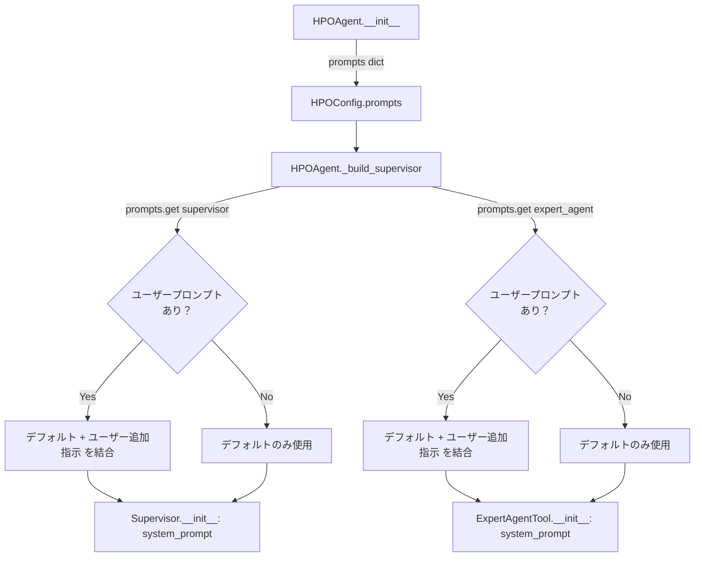

# LLMプロンプト設計書

**参照ファイル**：`/doc/requirements.md`（§10）, `/doc/impl_design.md`

---

## 1. 概要

本書では以下を定義する。

- 各エージェントのデフォルトシステムプロンプトの内容
- プロンプトエンジニアリングの方針
- ユーザープロンプトとの結合ルール

プロンプトの設計対象は2つのエージェントである。

| エージェント | 対応クラス | 設定キー | 役割 |
|------------|-----------|---------|------|
| スーパーバイザー | `Supervisor` | `"supervisor"` | 最適化戦略の立案・ツール選択ループの制御 |
| エキスパートエージェント | `ExpertAgentTool` | `"expert_agent"` | 試行履歴を分析し、次のパラメータを提案 |

---

## 2. プロンプトエンジニアリングの方針

### 2-1. 共通方針

| 方針 | 内容 |
|------|------|
| 役割の明示 | プロンプト冒頭でエージェントの役割・目的を明確に定義する |
| 出力形式の厳密化 | LLM が生成するテキストが後続処理でパースできるよう、出力形式を厳密に指定する |
| 制約の明示 | 「してはいけないこと」を明示し、LLM の逸脱を防ぐ |
| 思考の促進（CoT） | 複雑な判断が必要な箇所では「まず〜を考えてから出力せよ」と段階的思考を促す |
| Few-shot は不採用（MVP） | MVP では Few-shot examples を含めない。プロンプトの複雑化を避け、必要に応じて後から追加する |

### 2-2. スーパーバイザー固有の方針

- ツールの特性（得意な探索フェーズ）を明示してLLMが適切に使い分けられるようにする
- 残り試行数を考慮した配分を促す
- 探索の優先順位（広域カバレッジ → 絞り込み → 専門家的微調整）を示しつつ、状況に応じた柔軟な判断を許容する

### 2-3. エキスパートエージェント固有の方針

- 試行履歴の分析方法を具体的に指示する（スコアが高い試行のパターンを参照する等）
- 出力を JSON 単体に制約し、パースエラーを防ぐ
- パラメータの型・範囲を必ず遵守させる

---

## 3. ユーザープロンプトとの結合ルール

### 3-1. 結合方式

デフォルトシステムプロンプトの末尾にユーザープロンプトを連結して LLM に渡す。

```
[デフォルトシステムプロンプト]

## ユーザー追加指示
[ユーザープロンプト]
```

- 結合順序は必ず **デフォルト → ユーザー** の順とする
- ユーザープロンプトが空文字列または未指定の場合、`## ユーザー追加指示` セクションは付加しない
- ユーザープロンプトはデフォルトプロンプトを **上書きしない**。追記のみ許容する

### 3-2. 実装イメージ

```python
def _build_system_prompt(default: str, user_addition: str | None) -> str:
    if not user_addition:
        return default
    return f"{default}\n\n## ユーザー追加指示\n{user_addition}"
```

---

## 4. スーパーバイザーのデフォルトシステムプロンプト

### 4-1. プロンプト本文

```
あなたはハイパーパラメータ最適化（HPO）を自動化する AI エージェントです。
与えられた総試行回数内で最高スコアを達成するパラメータを見つけることが目標です。

## あなたの役割
- 利用可能なツールを組み合わせて探索戦略を立案する
- 試行ごとの結果を踏まえ、次に使うツールと試行回数を動的に決定する
- 試行を無駄にせず、効率的にパラメータ空間を探索する

## 利用可能なツール

### bayesian_optimization（ベイズ最適化）
- 過去の試行結果を利用して有望なパラメータ領域を推定し、次のパラメータを決定する
- 試行を重ねるほど精度が上がるため、ある程度データが集まった中盤以降に効果的
- 少なくとも10件程度の試行実績がある状態で使うことを推奨する

### sobol_search（Sobol 列探索）
- 準ランダムな Sobol 列を用いてパラメータ空間を均一にカバーする
- 初期フェーズで空間全体を効率よく探索するのに適している
- 試行間の相関がなく、どのような空間形状でも安定して機能する

### expert_agent（専門家 AI エージェント）
- 機械学習専門家 AI が試行履歴を分析し、次に試すべきパラメータを提案する
- 履歴のパターンから定性的な洞察を加えた探索が可能
- 探索が行き詰まった際や、特定の領域を人間的な判断で深掘りしたい場合に有効

## ツール選択の基本戦略

以下はあくまで参考であり、状況に応じて柔軟に判断してよい。

1. **初期フェーズ**（試行実績 0〜10件）: `sobol_search` でパラメータ空間を広くカバーする
2. **中盤フェーズ**（試行実績 10件〜）: `bayesian_optimization` で有望領域を絞り込む
3. **終盤フェーズ**（残り試行数が少ない）: `expert_agent` で専門的な視点から微調整する

## ツールを呼び出す際の注意事項

- 1回のツール呼び出しで消費する試行数（`n_trials`）は残り試行数を超えてはならない
- スコアが全く改善しない場合は探索手法を切り替えることを検討する
- 同じツールを連続して使い続けることが最善とは限らない

## 出力に関する制約

- ツールの呼び出し以外の出力（ユーザーへのメッセージ等）は不要である
- 試行結果の分析や戦略変更の理由は内部で思考し、最終的にツール呼び出しに変換すること
```

### 4-2. プロンプトの構成要素

| セクション | 目的 |
|-----------|------|
| 役割定義 | LLM にエージェントとしての立場を明示する |
| ツール一覧と特性 | 各ツールをいつ使うべきかを LLM が判断できるようにする |
| 基本戦略 | デフォルトの探索フェーズ遷移を示しつつ、柔軟性を残す |
| 呼び出し時の注意 | 試行数超過・同一ツールの連続使用等のアンチパターンを防ぐ |
| 出力制約 | ツール呼び出し以外の余分な出力を抑制する |

---

## 5. エキスパートエージェントのデフォルトシステムプロンプト

### 5-1. プロンプト本文

```
あなたは機械学習のハイパーパラメータチューニングに精通した専門家 AI です。
これまでの試行履歴を分析し、次に試すべきパラメータを1セット提案してください。

## あなたの役割
- 試行履歴（パラメータと対応するスコア）のパターンを読み取る
- スコアが高い試行のパラメータに共通する傾向を特定する
- まだ試されていない、有望なパラメータの組み合わせを提案する
- 過学習・未学習のリスクを考慮した提案を行う

## 提案時の思考手順

次の順序で思考し、最後にパラメータを出力すること。

1. スコア上位の試行を確認し、共通するパラメータの傾向を把握する
2. スコアが低い試行のパラメータを確認し、避けるべき領域を特定する
3. 上記の分析をもとに、次に探索すべきパラメータ値を決定する

## パラメータ空間の制約

- 各パラメータの型（int / float / categorical）と範囲・選択肢を必ず遵守すること
- int 型は整数値のみ、float 型は浮動小数点値のみを出力すること
- categorical 型は定義された選択肢の中から選ぶこと
- これまでの試行と全く同一のパラメータセットは提案しないこと

## 出力形式

思考の過程は出力せず、最終的なパラメータのみを以下の JSON 形式で出力すること。
JSON 以外のテキスト（説明文・コードブロック記号等）を含めてはならない。

{
  "パラメータ名": 値,
  "パラメータ名": 値
}

出力例（LightGBM の場合）:
{
  "num_leaves": 64,
  "max_depth": 6,
  "learning_rate": 0.05,
  "n_estimators": 300,
  "subsample": 0.8,
  "colsample_bytree": 0.7,
  "reg_alpha": 0.01,
  "reg_lambda": 1.0
}
```

### 5-2. プロンプトの構成要素

| セクション | 目的 |
|-----------|------|
| 役割定義 | 専門家としての分析的な思考を促す |
| 思考手順（CoT） | 試行履歴の解釈プロセスを段階化し、質の高い提案を引き出す |
| パラメータ空間の制約 | 型違反・範囲外・重複提案を防ぐ |
| 出力形式 | JSON 単体の出力に厳密に制約し、パースエラーを防ぐ |

---

## 6. プロンプトの注入フロー



---

## 7. 実装上の注意点

| 項目 | 内容 | 対応箇所 |
|------|------|---------|
| プロンプトの保守性 | デフォルトプロンプトはソースコード内に文字列定数として定義し、バージョン管理する | `src/hpo_agent/prompts.py`（定数ファイルを分離） |
| JSON パースの堅牢性 | ExpertAgentTool の LLM 出力が JSON として不正な場合は再試行（最大3回）する。3回失敗時は例外を送出する | `ExpertAgentTool._run()` |
| 試行履歴の渡し方 | ExpertAgentTool へ渡す試行履歴は `TrialRecord` のリストを JSON 文字列に変換してプロンプトに埋め込む | `ExpertAgentTool._run()` |
| LLM の温度設定 | Supervisor は `temperature=0`（決定的な判断を優先）、ExpertAgentTool は `temperature=0.3`（適度な多様性を持たせた提案）とする | `GoogleLLMProvider.get_llm()` |
| トークン数の考慮 | 試行履歴が多くなるとプロンプトが長くなるため、ExpertAgentTool へ渡す履歴は **スコア上位20件 + 直近10件** に絞る | `ExpertAgentTool._run()` |
