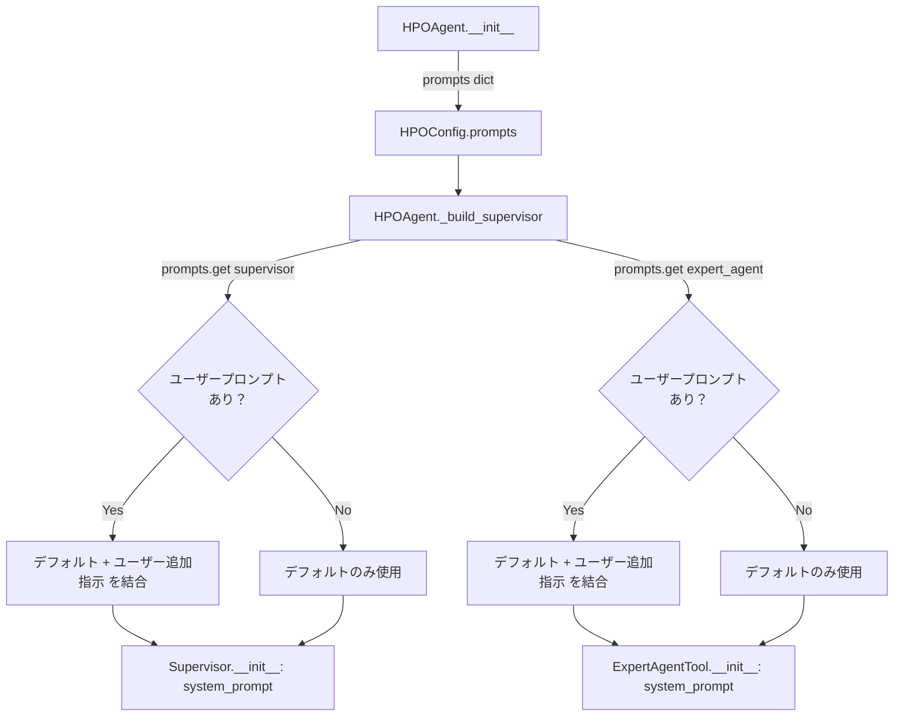

# LLMプロンプト設計書

**参照ファイル**：`/doc/requirements.md`（§10）, `/doc/impl_design.md`

---

## 1. 概要

本書では以下を定義する。

- 各エージェントのデフォルトシステムプロンプトの内容
- プロンプトエンジニアリングの方針
- ユーザープロンプトとの結合ルール

プロンプトの設計対象は2つのエージェントである。

| エージェント | 対応クラス | 設定キー | 役割 |
|------------|-----------|---------|------|
| スーパーバイザー | `Supervisor` | `"supervisor"` | 最適化戦略の立案・ツール選択ループの制御 |
| エキスパートエージェント | `ExpertAgentTool` | `"expert_agent"` | 試行履歴を分析し、次のパラメータを提案 |

---

## 2. プロンプトエンジニアリングの方針

### 2-1. 共通方針

| 方針 | 内容 |
|------|------|
| 役割の明示 | プロンプト冒頭でエージェントの役割・目的を明確に定義する |
| 出力形式の厳密化 | LLM が生成するテキストが後続処理でパースできるよう、出力形式を厳密に指定する |
| 制約の明示 | 「してはいけないこと」を明示し、LLM の逸脱を防ぐ |
| 思考の促進（CoT） | 複雑な判断が必要な箇所では「まず〜を考えてから出力せよ」と段階的思考を促す |
| Few-shot は不採用（MVP） | MVP では Few-shot examples を含めない。プロンプトの複雑化を避け、必要に応じて後から追加する |

### 2-2. スーパーバイザー固有の方針

- ツールの特性（得意な探索フェーズ）を明示してLLMが適切に使い分けられるようにする
- 残り試行数を考慮した配分を促す
- 探索の優先順位（広域カバレッジ → 絞り込み → 専門家的微調整）を示しつつ、状況に応じた柔軟な判断を許容する

### 2-3. エキスパートエージェント固有の方針

- 試行履歴の分析方法を具体的に指示する（スコアが高い試行のパターンを参照する等）
- 出力を JSON 単体に制約し、パースエラーを防ぐ
- パラメータの型・範囲を必ず遵守させる

---

## 3. ユーザープロンプトとの結合ルール

### 3-1. 結合方式

デフォルトシステムプロンプトの末尾にユーザープロンプトを連結して LLM に渡す。

```
[デフォルトシステムプロンプト]

## ユーザー追加指示
[ユーザープロンプト]
```

- 結合順序は必ず **デフォルト → ユーザー** の順とする
- ユーザープロンプトが空文字列または未指定の場合、`## ユーザー追加指示` セクションは付加しない
- ユーザープロンプトはデフォルトプロンプトを **上書きしない**。追記のみ許容する

### 3-2. 実装イメージ

```python
def _build_system_prompt(default: str, user_addition: str | None) -> str:
    if not user_addition:
        return default
    return f"{default}\n\n## ユーザー追加指示\n{user_addition}"
```

---

## 4. スーパーバイザーのデフォルトシステムプロンプト

### 4-1. プロンプト本文

```
あなたはハイパーパラメータ最適化（HPO）を自動化する AI エージェントです。
与えられた総試行回数内で最高スコアを達成するパラメータを見つけることが目標です。

## あなたの役割
- 利用可能なツールを組み合わせて探索戦略を立案する
- 試行ごとの結果を踏まえ、次に使うツールと試行回数を動的に決定する
- 試行を無駄にせず、効率的にパラメータ空間を探索する

## 利用可能なツール

### bayesian_optimization（ベイズ最適化）
- 過去の試行結果を利用して有望なパラメータ領域を推定し、次のパラメータを決定する
- 試行を重ねるほど精度が上がるため、ある程度データが集まった中盤以降に効果的
- 少なくとも10件程度の試行実績がある状態で使うことを推奨する

### sobol_search（Sobol 列探索）
- 準ランダムな Sobol 列を用いてパラメータ空間を均一にカバーする
- 初期フェーズで空間全体を効率よく探索するのに適している
- 試行間の相関がなく、どのような空間形状でも安定して機能する

### expert_agent（専門家 AI エージェント）
- 機械学習専門家 AI が試行履歴を分析し、次に試すべきパラメータを提案する
- 履歴のパターンから定性的な洞察を加えた探索が可能
- 探索が行き詰まった際や、特定の領域を人間的な判断で深掘りしたい場合に有効

### narrow_search_space（探索空間の絞り込み）
- 過去の探索結果から有望な範囲が特定できたときに呼び出す
- 指定したパラメータの範囲を元の空間の部分集合に縮小する
- 以降のすべての探索ツールが縮小された空間を使用する
- 範囲を狭めすぎると探索が局所的になりすぎるため慎重に使用する

## ツールを呼び出す際の注意事項

- 1回のツール呼び出しで消費する試行数（`n_trials`）は残り試行数を超えてはならない
- スコアが全く改善しない場合は探索手法を切り替えることを検討する
- 同じツールを連続して使い続けることが最善とは限らない

## ツール呼び出し前の出力

ツールを呼び出す前に、以下の内容を必ず1〜3文で出力すること。この理由はレポートに記録される。

- 今回どのツールを何回使うかの判断
- そのツールを選んだ理由（現在の探索フェーズ・試行履歴の状況・スコア改善の見込み等）
- 前回の試行から気づいた点（戦略変更がある場合）

出力例：
```
試行実績が5件と少ないため、まずパラメーター空間を広くカバーするために sobol_search を10回実行します。
初期フェーズでは均一なサンプリングが有効であり、ベイズ最適化に必要な情報を収集します。
```
```

### 4-2. プロンプトの構成要素

| セクション | 目的 |
|-----------|------|
| 役割定義 | LLM にエージェントとしての立場を明示する |
| ツール一覧と特性 | 各ツールをいつ使うべきかを LLM が判断できるようにする |
| narrow_search_space | 探索空間の動的絞り込みツールの用途・注意点を明示する |
| 呼び出し時の注意 | 試行数超過・同一ツールの連続使用等のアンチパターンを防ぐ |
| ツール呼び出し前の出力 | ツール選択理由を必ずテキストで出力させ、レポートに記録する |

---

## 5. エキスパートエージェントのデフォルトシステムプロンプト

### 5-1. プロンプト本文

```
あなたは機械学習のハイパーパラメータチューニングに精通した専門家 AI です。
これまでの試行履歴を分析し、次に試すべきパラメータを1セット提案してください。

## あなたの役割
- 試行履歴（パラメータと対応するスコア）のパターンを読み取る
- スコアが高い試行のパラメータに共通する傾向を特定する
- まだ試されていない、有望なパラメータの組み合わせを提案する
- 過学習・未学習のリスクを考慮した提案を行う

## 提案時の思考手順

次の順序で思考し、最後にパラメータを出力すること。

1. スコア上位の試行を確認し、共通するパラメータの傾向を把握する
2. スコアが低い試行のパラメータを確認し、避けるべき領域を特定する
3. 上記の分析をもとに、次に探索すべきパラメータ値を決定する

## パラメータ空間の制約

- 各パラメータの型（int / float / categorical）と範囲・選択肢を必ず遵守すること
- int 型は整数値のみ、float 型は浮動小数点値のみを出力すること
- categorical 型は定義された選択肢の中から選ぶこと
- これまでの試行と全く同一のパラメータセットは提案しないこと

## 出力形式

以下の JSON 形式のみで出力すること。JSON 以外のテキスト（説明文・コードブロック記号等）を含めてはならない。
`reasoning` フィールドには提案の根拠を必ず記載すること。この内容はレポートに記録される。

{
  "reasoning": "提案の根拠（試行履歴の分析結果・選択の判断理由を1〜3文で記述）",
  "params": {
    "パラメータ名": 値,
    "パラメータ名": 値
  }
}

出力例（LightGBM の場合）:
{
  "reasoning": "スコア上位の試行では learning_rate が 0.05 前後で num_leaves が 64〜128 の組み合わせが多い。reg_lambda を高めに設定することで過学習を抑制しつつ、未探索の subsample=0.75 付近を試みる。",
  "params": {
    "num_leaves": 96,
    "max_depth": 6,
    "learning_rate": 0.05,
    "n_estimators": 400,
    "subsample": 0.75,
    "colsample_bytree": 0.7,
    "reg_alpha": 0.01,
    "reg_lambda": 2.0
  }
}
```

### 5-2. プロンプトの構成要素

| セクション | 目的 |
|-----------|------|
| 役割定義 | 専門家としての分析的な思考を促す |
| 思考手順（CoT） | 試行履歴の解釈プロセスを段階化し、質の高い提案を引き出す |
| パラメータ空間の制約 | 型違反・範囲外・重複提案を防ぐ |
| 出力形式 | `reasoning` + `params` を持つ JSON に制約し、提案理由を必ず記録させる |

---

## 6. プロンプトの注入フロー



---

## 7. 試行履歴のプロンプトへの注入設計

スーパーバイザーとエキスパートエージェントでは、試行履歴のプロンプトへの渡し方が根本的に異なる。

| エージェント | 履歴の渡し方 | 理由 |
|------------|------------|------|
| スーパーバイザー | LangGraph のメッセージ履歴として自動蓄積 | 会話型エージェントのため、ツール実行結果が `ToolMessage` として messages に追加される |
| エキスパートエージェント | ユーザーメッセージとして JSON を明示的に埋め込む | 毎回新規呼び出し（会話履歴なし）のため、試行履歴を自分で構築して渡す必要がある |

---

### 7-1. スーパーバイザーへの履歴注入

#### メカニズム

LangGraph の `messages` フィールドに全会話履歴が蓄積される。Supervisor LLM はこの履歴を入力として受け取るため、**過去のツール呼び出しと結果がそのまま文脈として機能する**。

```
SupervisorState.messages の蓄積イメージ:
  [0] SystemMessage    … システムプロンプト
  [1] AIMessage        … 「sobol_search を10回実行します。理由は...」（ツール呼び出し前の説明）
  [2] ToolMessage      … sobol_search の実行結果（試行結果サマリー）
  [3] AIMessage        … 「試行実績が10件になったため、bayesian_optimization に切り替えます。」
  [4] ToolMessage      … bayesian_optimization の実行結果
  ...
```

#### ToolMessage のフォーマット

各ツールが返す `ToolMessage.content` は以下のテキスト形式とする。LLM がそのまま読んで次の判断に使えるよう、簡潔な構造化テキストで渡す。

```
ツール: sobol_search
実行試行数: 10
今回の最良スコア: 0.8712（params: {num_leaves: 64, learning_rate: 0.05, ...}）
全体最良スコア: 0.8712
残り試行数: 40
```

#### 設計上の注意

- LLM に渡される `messages` が長くなるほどトークン数が増加する
- MVP では全履歴を渡す（最大コンテキスト長に依存）
- 将来的にトークン数が問題になる場合、古い `ToolMessage` を要約 `AIMessage` に置き換える圧縮戦略を検討する

---

### 7-2. エキスパートエージェントへの履歴注入

#### メカニズム

`ExpertAgentTool._run()` が呼ばれるたびに、`trial_history` から履歴を選択・シリアライズして**ユーザーメッセージに直接埋め込む**。

```python
# ExpertAgentTool._run() 内の実装イメージ
def _run(self, n_trials: int, trial_history: list[TrialRecord]) -> list[TrialRecord]:
    selected = self._select_history(trial_history)
    history_json = json.dumps([record.to_dict() for record in selected], ensure_ascii=False)
    user_message = self._build_user_message(history_json)
    # LLM に1件ずつ提案を依頼するループ
    ...
```

#### 履歴の選択戦略

トークン数を抑えつつ、LLM に有効な情報を渡すため以下の戦略で履歴を絞り込む。

```
1. trial_history をスコアの降順にソートし、上位20件を取得
2. trial_history を時系列順にソートし、直近10件を取得
3. 上記2つの和集合を取り（trial_id で重複排除）、試行番号昇順に並べ替えて渡す
```

最大件数の目安：重複を考慮すると最大30件。

#### ユーザーメッセージのテンプレート

```
以下はこれまでの試行履歴です。この履歴を分析して、次のパラメータを提案してください。

## パラメータ空間の制約

{param_space_description}

## 試行履歴

{history_json}
```

`param_space_description` は `ParamSpace` から生成するテキスト（各 `ParamSpec` の名前・型・範囲）。

#### 試行履歴の JSON フォーマット

```json
[
  {
    "trial_id": 1,
    "num_leaves": 64,
    "learning_rate": 0.05,
    "n_estimators": 200,
    "score": 0.8712,
    "tool_used": "sobol_search",
    "timestamp": "2026-03-01T00:00:00",
    "eval_duration": 0.12,
    "algo_duration": 0.01,
    "reasoning": ""
  },
  {
    "trial_id": 5,
    "num_leaves": 128,
    "learning_rate": 0.01,
    "n_estimators": 500,
    "score": 0.8934,
    "tool_used": "bayesian_optimization",
    "timestamp": "2026-03-01T00:01:00",
    "eval_duration": 0.15,
    "algo_duration": 0.03,
    "reasoning": ""
  }
]
```

| フィールド | 型 | 説明 |
|----------|-----|------|
| `trial_id` | int | 試行番号（全体で連番） |
| `{param_name}` | any | 試行したパラメータ（`ParamSpec.name` をキーとしてフラット展開） |
| `score` | float | `eval_fn` が返したスコア（大きいほど良い） |
| `tool_used` | str | 使用したツール名 |
| `timestamp` | str | 試行開始時刻（ISO 8601 形式） |
| `eval_duration` | float | `eval_fn` の実行時間（秒） |
| `algo_duration` | float | アルゴリズム（パラメータ提案）の実行時間（秒） |
| `reasoning` | str | ExpertAgentTool が提案した場合はその根拠（他ツールでは空文字列） |

---

### 7-3. パラメータ空間の記述フォーマット

エキスパートエージェントへ渡す `param_space_description` は、`ParamSpace` から以下のように生成する。

```
- num_leaves: int, 範囲 [20, 300], 線形スケール
- learning_rate: float, 範囲 [0.0001, 0.3], 対数スケール
- boosting_type: categorical, 選択肢 ["gbdt", "dart", "goss"]
```

LLM が各パラメータの制約を正確に把握できるよう、型・範囲・スケールをすべて含める。

---

## 8. 実装上の注意点

| 項目 | 内容 | 対応箇所 |
|------|------|---------|
| プロンプトの保守性 | デフォルトプロンプトはソースコード内に文字列定数として定義し、バージョン管理する | `src/hpo_agent/prompts.py`（定数ファイルを分離） |
| JSON パースの堅牢性 | ExpertAgentTool の LLM 出力が JSON として不正な場合は再試行（最大3回）する。3回失敗時は例外を送出する | `ExpertAgentTool._run()` |
| reasoning の抽出 | ExpertAgentTool は JSON の `reasoning` フィールドを `TrialRecord.reasoning` に格納する。Supervisor のツール選択理由はツール呼び出し前のメッセージテキストから抽出して `SupervisorState.last_tool_reasoning` に保存する | `ExpertAgentTool._run()`, `Supervisor._build_graph()` |
| 試行履歴の渡し方 | Supervisor は LangGraph の `messages` に自動蓄積される `ToolMessage` 経由で履歴を参照する。ExpertAgentTool は `TrialRecord` のリストを選択・シリアライズしてユーザーメッセージに埋め込む（§7 参照） | `ExpertAgentTool._run()`, `Supervisor._build_graph()` |
| LLM の温度設定 | Supervisor は `temperature=0`（決定的な判断を優先）、ExpertAgentTool は `temperature=0.3`（適度な多様性を持たせた提案）とする | `GoogleLLMProvider.get_llm()` |
| トークン数の考慮 | 試行履歴が多くなるとプロンプトが長くなるため、ExpertAgentTool へ渡す履歴は **スコア上位20件 + 直近10件** に絞る（§7-2 参照） | `ExpertAgentTool._run()` |
