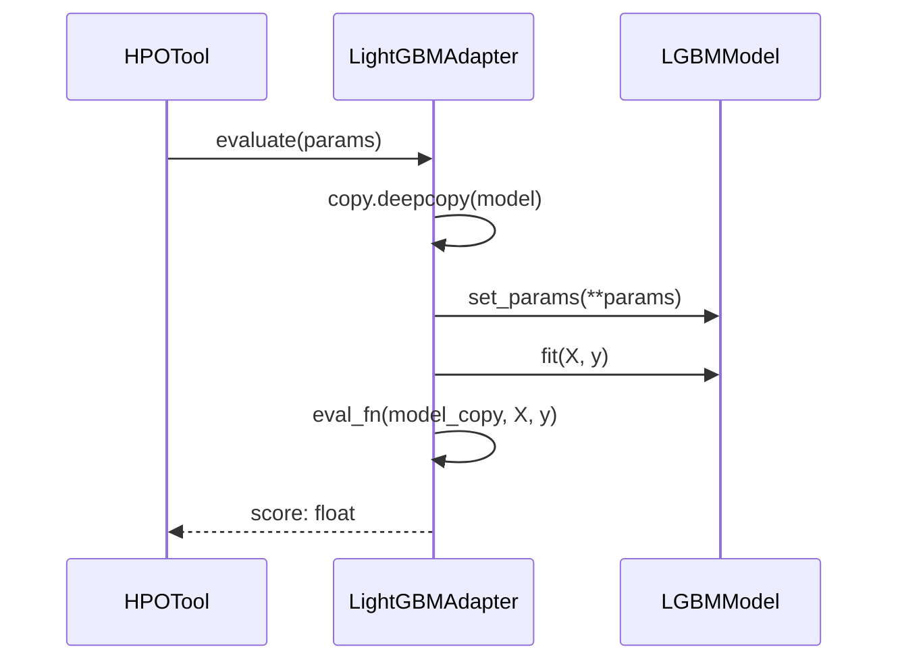
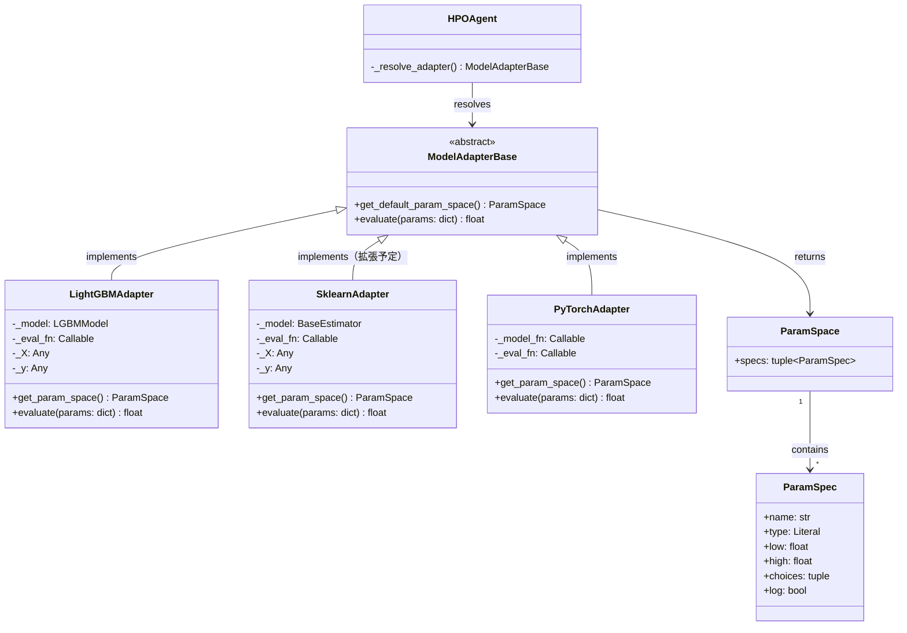

# モデルアダプター設計書

**参照ファイル**：`/doc/requirements.md`, `/doc/impl_design.md`

---

## 1. 設計の目的

HPO ツール（`BayesianOptimizationTool` 等）はモデルの種類を意識せず `ModelAdapterBase` のインターフェースのみに依存する。
各モデル固有の API 差異（LightGBM / sklearn / PyTorch）やパラメータ空間の定義方法をアダプターが吸収し、ツール側のコード変更なしにモデルを切り替えられる設計とする。

---

## 2. データ構造

### 2-1. `ParamSpec`

1つのハイパーパラメータの仕様を表す **イミュータブルなデータクラス**。

```python
@dataclass(frozen=True)
class ParamSpec:
    name: str
    type: Literal["int", "float", "categorical"]
    low: float | None = None          # 数値型（int / float）の下限（inclusive）
    high: float | None = None         # 数値型（int / float）の上限（inclusive）
    choices: tuple[Any, ...] | None = None  # categorical の選択肢
    log: bool = False                 # True のとき対数スケールでサンプリング
```

#### フィールドの制約

| type | 必須フィールド | 禁止フィールド | `log` の使用 |
|------|-------------|------------|------------|
| `"int"` | `low`, `high` | `choices` | 可（`low > 0` のとき有効） |
| `"float"` | `low`, `high` | `choices` | 可（`low > 0` のとき有効） |
| `"categorical"` | `choices` | `low`, `high`, `log` | 不可 |

#### 例

```python
# 整数・線形スケール
ParamSpec(name="num_leaves", type="int", low=20, high=300)

# 浮動小数点・対数スケール
ParamSpec(name="learning_rate", type="float", low=1e-4, high=0.3, log=True)

# カテゴリカル
ParamSpec(name="boosting_type", type="categorical", choices=("gbdt", "dart", "goss"))
```

---

### 2-2. `ParamSpace`

`ParamSpec` の集合を表す **イミュータブルなデータクラス**。

```python
@dataclass(frozen=True)
class ParamSpace:
    specs: tuple[ParamSpec, ...]
```

- `specs` はタプル（順序を持ち、イミュータブル）
- 各ツールは `ParamSpace` を受け取り、内部的に `ParamSpec` を解釈してサンプラーに渡す

---

## 3. インターフェース定義

### 3-1. `ModelAdapterBase`

```python
class ModelAdapterBase(ABC):
    @abstractmethod
    def get_default_param_space(self) -> ParamSpace:
        """モデル固有のデフォルトパラメータ空間を返す。HPOConfig.param_space が未指定のときに使用される。"""
        ...

    @abstractmethod
    def evaluate(self, params: dict[str, Any]) -> float:
        """指定されたパラメータでモデルを学習・評価してスコアを返す。"""
        ...
```

#### パラメーター空間の決定ルール

ツールが実際に使用する `ParamSpace` は以下の優先順位で決定する。

```
HPOConfig.param_space が指定されている
    → ユーザー指定の ParamSpace を使用（アダプターのデフォルトは無視）
HPOConfig.param_space が None（未指定）
    → ModelAdapterBase.get_default_param_space() の返り値を使用
```

この解決は `HPOAgent._resolve_adapter()` で行い、決定した `ParamSpace` をツールに渡す。

#### `evaluate()` の契約

- `params` は使用される `ParamSpace` の `ParamSpec.name` をキーとする辞書
- 戻り値は **大きいほど良いスコア**（損失関数の場合は呼び出し側で符号反転する）
- モデルオブジェクトを破壊しない（内部でディープコピーを行う）
- 例外が発生した場合はそのまま伝播させる（ツール側でハンドリングする）

---

## 4. LightGBMAdapter

### 4-1. クラス定義

```python
class LightGBMAdapter(ModelAdapterBase):
    def __init__(
        self,
        model: lgb.LGBMModel,
        eval_fn: Callable[[lgb.LGBMModel, Any, Any], float],
        X: Any,
        y: Any,
    ) -> None: ...

    def get_default_param_space(self) -> ParamSpace: ...
    def evaluate(self, params: dict[str, Any]) -> float: ...
```

> `X`, `y` はアダプター生成時に渡し、`evaluate()` 内部で使用する。
> ユーザーは `eval_fn(model, X, y) -> float` のシグネチャで評価関数を定義する。

---

### 4-2. デフォルトパラメータ空間

MVP では以下の8パラメータをデフォルト空間として定義する。

| パラメータ名 | type | low | high | log | 説明 |
|------------|------|-----|------|-----|------|
| `num_leaves` | `int` | 20 | 300 | False | 葉の最大数。過学習の主要な制御パラメータ |
| `max_depth` | `int` | 3 | 12 | False | 木の最大深さ（-1 で無制限だが MVP では範囲指定） |
| `learning_rate` | `float` | 1e-4 | 0.3 | True | 学習率。対数スケールで広い範囲を探索 |
| `n_estimators` | `int` | 50 | 1000 | False | ブースティングの反復回数 |
| `subsample` | `float` | 0.5 | 1.0 | False | 行サンプリング率 |
| `colsample_bytree` | `float` | 0.5 | 1.0 | False | 列サンプリング率 |
| `reg_alpha` | `float` | 1e-8 | 10.0 | True | L1 正則化係数 |
| `reg_lambda` | `float` | 1e-8 | 10.0 | True | L2 正則化係数 |

---

### 4-3. `evaluate()` の処理フロー

```python
def evaluate(self, params: dict[str, Any]) -> float:
    model_copy = copy.deepcopy(self._model)  # モデルオブジェクトを汚染しない
    model_copy.set_params(**params)
    model_copy.fit(self._X, self._y)
    return self._eval_fn(model_copy, self._X, self._y)
```

#### シーケンス図



---

## 5. 将来の拡張

### 5-1. sklearn 系モデル（拡張予定）

sklearn の `BaseEstimator` を持つモデルに対応する。インターフェースは LightGBM と同一だが、パラメータ空間は **モデルクラスごとに個別定義**する。

```python
class SklearnAdapter(ModelAdapterBase):
    def __init__(
        self,
        model: BaseEstimator,
        eval_fn: Callable[[BaseEstimator, Any, Any], float],
        X: Any,
        y: Any,
    ) -> None: ...
```

- `get_param_space()` はモデルクラスに基づいて事前定義された空間を返す
- `evaluate()` は `clone(model)` → `set_params()` → `fit()` → `eval_fn()` のフロー（`copy.deepcopy` の代わりに `sklearn.base.clone` を使用）

---

### 5-2. PyTorch モデル

PyTorch は `fit` / `predict` を持たないため、学習・評価ループ全体を `eval_fn` に委譲する設計とする。
`torch` への依存はなく、型ヒントは `Any` を使用する（メイン依存に `torch` を含めないため）。

```python
class PyTorchAdapter(ModelAdapterBase):
    def __init__(
        self,
        model_fn: Callable[[dict[str, Any]], Any],  # パラメータを受け取りモデルを返す関数
        eval_fn: Callable[[Any], float],             # 学習・評価ループ全体
        param_space: ParamSpace,                     # ユーザーが必ず指定する
    ) -> None: ...
```

- `get_default_param_space()` はコンストラクタで渡した `param_space` をそのまま返す
- `evaluate(params)` は `model_fn(params)` → `eval_fn(model)` のフロー
- `param_space` は必須（デフォルト空間なし。モデル構造に依存するため）
- `HPOAgent` に `model` として callable（model_fn）を渡すと自動的に `PyTorchAdapter` が選択される

---

## 6. アダプターの解決方法

`HPOAgent._resolve_adapter()` がモデルオブジェクトの型を検査し、適切なアダプターと使用する `ParamSpace` を決定して返す。

```python
def _resolve_adapter(self) -> tuple[ModelAdapterBase, ParamSpace]:
    model = self._config.model
    if isinstance(model, lgb.LGBMModel):
        adapter = LightGBMAdapter(model, self._config.eval_fn, ...)
    elif callable(model):
        # model_fn（PyTorch ファクトリ関数）として扱う
        if self._config.param_space is None:
            raise ValueError("PyTorch モデルを使用する場合は param_space の指定が必須です。")
        adapter = PyTorchAdapter(
            model_fn=model,
            eval_fn=self._config.eval_fn,
            param_space=self._config.param_space,
        )
    else:
        raise TypeError(f"Unsupported model type: {type(model)}")

    # ユーザー指定の param_space を優先。未指定の場合はアダプターのデフォルトを使用
    param_space = self._config.param_space or adapter.get_default_param_space()
    return adapter, param_space
```

### モデル型とアダプターの対応表

| モデルの型 | 使用するアダプター | 対応状況 |
|-----------|----------------|---------|
| `lgb.LGBMModel` のサブクラス | `LightGBMAdapter` | Yes |
| callable（PyTorch model_fn） | `PyTorchAdapter` | Yes |
| `sklearn.base.BaseEstimator` のサブクラス | `SklearnAdapter` | No（拡張予定） |

---

## 7. クラス図（Mermaid）



---

## 8. 実装上の注意点

| 項目 | 内容 | 対応箇所 |
|------|------|---------|
| モデルのディープコピー | `evaluate()` は毎回 `copy.deepcopy(model)` を行い、元のモデルオブジェクトを変更しない | `LightGBMAdapter.evaluate()` |
| sklearn は `clone()` を使用 | `copy.deepcopy` ではなく `sklearn.base.clone()` を使うことで fitted な状態をリセットできる | `SklearnAdapter.evaluate()` |
| スコアの方向統一 | `eval_fn` は **大きいほど良いスコア** を返す規約とする。損失関数を使う場合はユーザー側で符号反転する | `ModelAdapterBase.evaluate()` の契約 |
| パラメータ空間のカスタマイズ | MVP では LightGBM のデフォルト空間を固定するが、将来的に `HPOAgent` 引数でユーザーが上書き可能にする設計を想定する | `LightGBMAdapter.get_param_space()` |
| `log=True` の制約 | 対数スケールを使用する場合、`low > 0` である必要がある。バリデーションは `ParamSpec.__post_init__()` で行う | `ParamSpec` |
